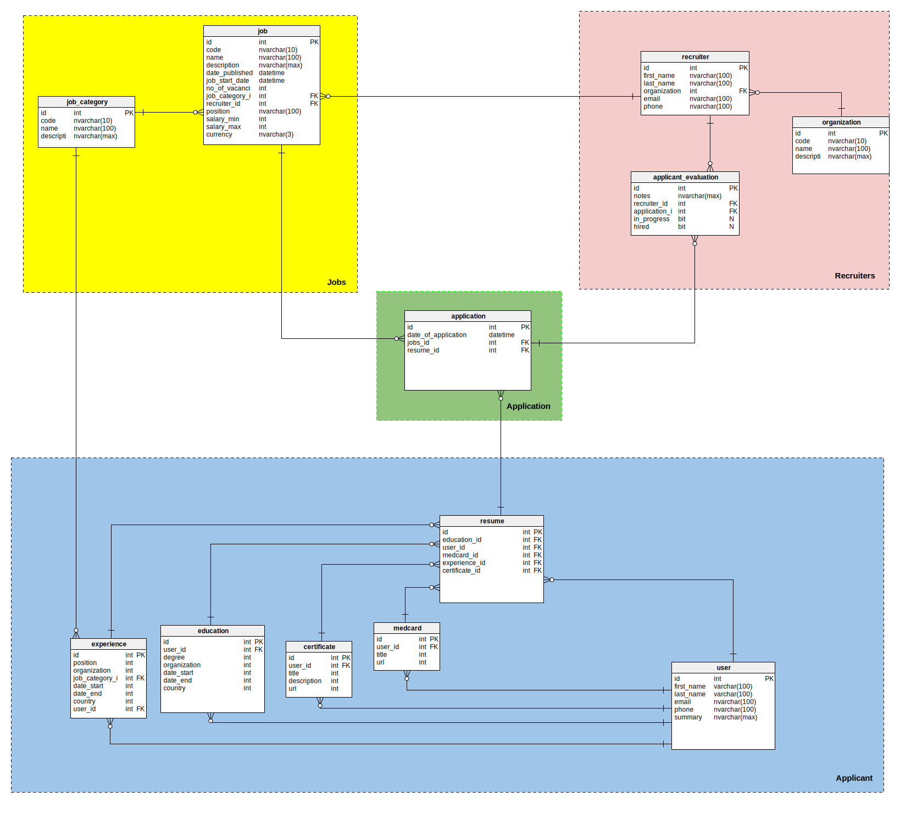

# Digital Resume API

## Database Schema

## Installation
    git clone git@github.com:temirgaliyev/Digital-Resume-API.git
    cd Digital-Resume-API
    pip install -r requirements.txt
    python wsgi.py

# REST API

## User
### Get user by `id`, `email`, `phone` [`GET`]
    curl -i -H 'Accept: application/json' http://127.0.0.1:5000/api/v1/user?id={id}
    curl -i -H 'Accept: application/json' http://127.0.0.1:5000/api/v1/user?email={email}
    curl -i -H 'Accept: application/json' http://127.0.0.1:5000/api/v1/user?phone={phone}

#### Get all users
    curl -i -H 'Accept: application/json' http://127.0.0.1:5000/api/v1/user/

### Create new user [`POST`]
    curl -i -H 'Accept: application/json' -X POST -d '{"first_name":"First", "last_name":"Last", "email":"maiaalaa@ma.ru", "phone":"+123456789", "password":"pass"}' http://127.0.0.1:5000/api/v1/user

### Update user by `id`, `email` [`PUT`]
    curl -i -H 'Accept: application/json' -X PUT -d '{"_email":"maiaalaa@ma.ru", "first_name":"First", "last_name":"Last"}' http://127.0.0.1:5000/api/v1/user

### Delete user by `id` [`DELETE`]
    curl -i -H 'Accept: application/json' -X PUT -d '{"id":"{id}"}' http://127.0.0.1:5000/api/v1/user

